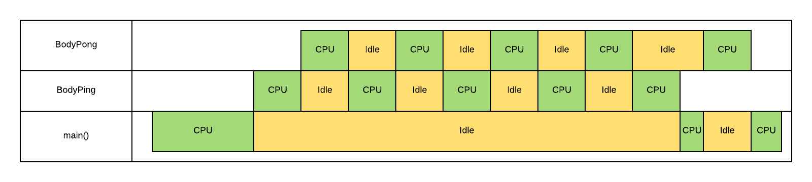

# Trocas de Contexto
	
### Chamadas POSIX

Quatro chamadas de sistema permitem manipular contexto de forma mais simples, permitindo que o programador possa efetuar as operações sem precisar trabalhar diretamente com registradores.

#### getcontext(&a)
Essa função salva o contexto atual (ou seja, os apontamentos de registradores no estado atual do programa, como o program counter) na variável **a**, inicializando-a. 

O objetivo dessa função é inicializar devidamente a estrutura *ucontext_t* (que deve ser o tipo da variável **a**), que vai controlar a execução desse contexto. Nessa estrutura, é indicado o contexto de retorno após a linha de execução atual finalizar (através do membro *uc_link*), a pilha atual de execução (membro *uc_stack*) e até mesmo uma estrutura que contém uma representação em máquina dos registradores usados (membro *uc_mcontext*). Essas informações foram retiradas do próprio manual da função [1].

Em caso de sucesso, retorna 0. Se houver algum erro, retorna -1.

#### setcontext(&a)
Essa função deve ser utilizada em conjunto com **getcontext**, pois restaura um contexto salvo previamente por uma chamada a **getcontext**. Quando restaurado, o contexto continua sua execução do ponto onde havia parado.

Outra opção é restaurar um contexto alterado a partir de uma chamada para **makecontext**. Nesse caso, o contexto é restaurado na função previamente enviada para a função **makecontext** como segundo parâmetro.

O manual [1] também afirma que é possível restaurar um contexto obtido através de um tratador de sinais de interrupção; porém, o comportamento atual não é especificado. 

#### swapcontext(&a, &b)
Essa função é um atalho para chamadas sucessivas de **getcontext(&a)** e **setcontext(&b)**, ou seja, salva o contexto atual em **a** e restaura o contexto armazenado em **b**.

#### makecontext(&a, &func, arg)
Essa função modifica um contexto obtido previamente por **getcontext**. Antes de chamar essa função, é necessário alocar o contexto e definir os membros *uc_stack* e *uc_link*. O membro *uc_stack* é a própria linha de execução atual, enquanto *uc_link* é o contexto que deve retomar a execução quando **a** retornar.

#### ucontext_t
No código, são usados os membros *uc_stack* e *uc_link*.

*uc_stack* é uma struct do tipo *stack_t*, e vai guardar a pilha de execução atual; ou melhor, a área de memória usada para a execução, através do seu membro *ss_sp*. Porém, a página do manual indica que:

"The GNU C Library and most other Unix implementations require the ss_sp value of the uc_stack element to point to the base of the memory region allocated for the stack and the size of the memory region is stored in ss_size. There are implementations out there which require ss_sp to be set to the value the stack pointer will have (which can, depending on the direction the stack grows, be different)." [2]

Logo, alocar *ss_sp* implica que é necessário alocar também *ss_size*. Esse valor deve ser em bits, e normalmente é 32768 bits (ou 4 KB). Parece um valor óbvio pelo fato da maior parte das arquiteturas usar esse valor como padrão para uma página de memória. [3]

Ao setar a propriedade *uc_link*, podemos definir qual contexto será resumido após o fim da execução do contexto que estamos configurando. Deve apontar para uma variável do tipo *context_t*. No código, a execução retorna para a função principal, então esse campo pode ser nulo (ou zero).

#### Análise do código
- **Linha 59**: 
```
getcontext (&ContextPing);
```
O contexto ContextPing é inicializado, usando o contexto atual (da função **main()** como base).

- **Linhas 64-67**: 
```
ContextPing.uc_stack.ss_sp = stack;
ContextPing.uc_stack.ss_size = STACKSIZE;
ContextPing.uc_stack.ss_flags = 0;
ContextPing.uc_link = 0;
```
As estruturas do contexto *ContextPing* são inicializadas: uma região de memória (*uc_stack.ss_sp*) é alocada, com o tamanho de página (*uc_stack.ss_size*) padrão definido na constante *STACKSIZE*, de 4 KB. Nenhuma sinal é bloqueado (*uc_stack.ss_flags* = 0), e não é definido um contexto específico para ser usado quando este contexto retornar.

- **Linha 75**:
```
makecontext (&ContextPing, (void*)(*BodyPing), 1, "    Ping");
```
A função *BodyPing* é definida como a função de inicialização do contexto *ContextPing* (ou seja, deve executar quando esse contexto for ativado), o inteiro *1* representa que a função recebe um parâmetro, e a string *"    Ping"* é o parâmetro usado por *BodyPing*.

- **Linha 77**:
```
getcontext (&ContextPong);
```
O contexto ContextPong é inicializado, usando o contexto atual (da função **main()** como base).

- **Linha 82-85**:
```
ContextPong.uc_stack.ss_sp = stack;
ContextPong.uc_stack.ss_size = STACKSIZE;
ContextPong.uc_stack.ss_flags = 0;
ContextPong.uc_link = 0;
```
As estruturas do contexto *ContextPong* são inicializadas, assim como ocorre nas linhas 64-67 com *ContextPing*.

- **Linha 93**:
```
makecontext (&ContextPong, (void*)(*BodyPong), 1, "        Pong");
```
A função *BodyPong* é definida como a função de inicialização do contexto *ContextPong* (ou seja, deve executar quando esse contexto for ativado), o inteiro *1* representa que a função recebe um parâmetro, e a string *"        Pong"* é o parâmetro usado por *BodyPong*.

- **Linha 95**:
```
swapcontext (&ContextMain, &ContextPing);
```
O contexto atual é salvo em *ContextMain*, e o contexto em *ContextPing* é ativado (inicializando a função *BodyPing*).

- **Linha 26**:
```
swapcontext (&ContextPing, &ContextPong);
```
Dentro da função *BodyPing*, quando essa linha é executada, o contexto atual é salvo (estado dos registradores, por exemplo; o que permite gravar qual a posição atual do *i* em que o laço se encontra), e o contexto em *ContextPong* é ativado (no caso da primeira execução, quando i = 0, é inicializada a função *BodyPong* registrada anteriormente).

- **Linha 44**:
```
swapcontext (&ContextPong, &ContextPing);
```
Dentro da função *BodyPong*, quando essa linha é executada, o contexto atual é salvo em *ContextPong* e o contexto em *ContextPing* é resumido; ou seja, voltando para o estado anterior e executando a próxima repetição no laço (ao reativar *ContextPing* a função *não* reinicia).

- **Linha 30**:
```
swapcontext (&ContextPing, &ContextMain) ;
```
Após 4 chamadas na linha 26, agora *swapcontext* é chamada na linha 30. Aqui, o laço encerrou, o contexto é salvo em *ContextPing* e o contexto da main (em *ContextMain) é resumido.

- **Linha 96**:
```
swapcontext (&ContextMain, &ContextPong);
```
Essa chamada não inicializa *ContextPong*: isso já ocorreu anteriormente nas chamadas de *swapcontext* dentro de *ContextPing*. Ela serve apenas para retornar o controle a *ContextPong* para que a execução fora do laço em *BodyPong* (que contém uma chamada com "FIM" para *printf*) prossiga.

- **Linha 48**:
```
swapcontext (&ContextPong, &ContextMain) ;
```
O contexto atual é salvo em *ContextPong* e o contexto armazenado em ContextMain retorna. Nesse ponto, mesmo que existissem outras chamadas para *ContextPong* na função *main()*, nada mais seria exibido.

#### Diagrama de execução
 

#### Referências

[1] http://man7.org/linux/man-pages/man3/getcontext.3.html
[2] https://www.gnu.org/software/libc/manual/html_node/System-V-contexts.html
[3] https://en.wikipedia.org/wiki/Page_(computer_memory)